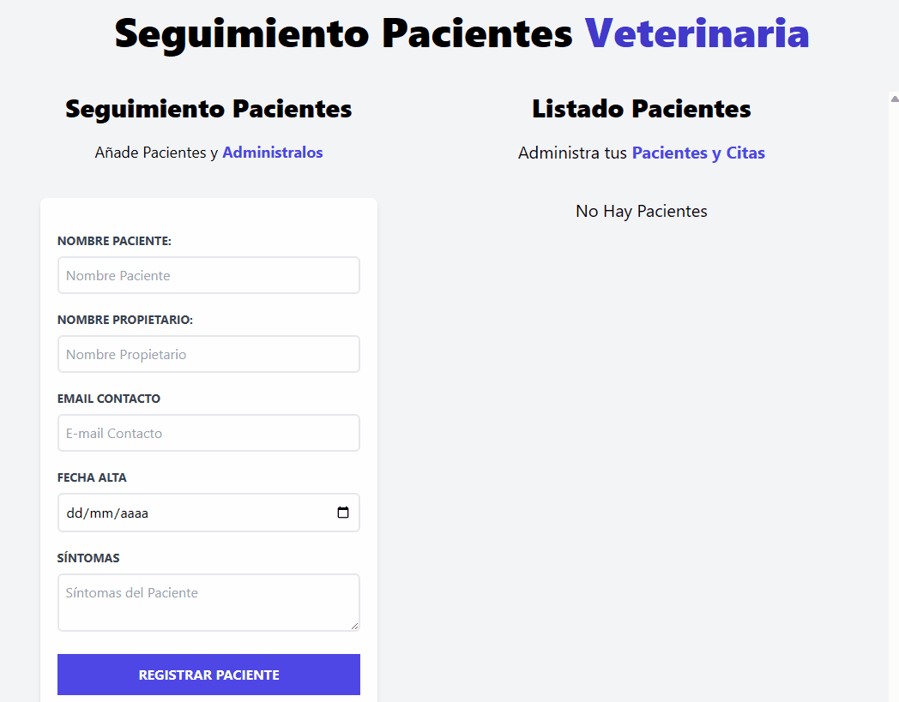

# 🐾 Administrador de Pacientes - JS Vanilla (POO)

## 📽️ Demo en Vivo


> Una aplicación web interactiva diseñada para la gestión y control de citas en una clínica veterinaria, permitiendo el registro, edición y eliminación de pacientes en tiempo real con una arquitectura orientada a objetos.

**[🔗 Ver Demo en Vivo](https://pabloramirezcasas.github.io/tu-repositorio/)**


## 🚀 Funcionalidades Principales
- **Gestión CRUD Completa:** Interfaz interactiva para añadir (Create), listar (Read), modificar (Update) y eliminar (Delete) registros de pacientes sin recargar la página.
- **Validación Multicapa Dinámica:** Uso del método `.some()` para verificar campos vacíos y evitar la redundancia o duplicación de alertas visuales en el DOM.
- **Sistema de Notificaciones Inteligente:** Alertas efímeras y contextuales (éxito/error) que guían al usuario durante las interacciones con el formulario.
- **Persistencia de Estado de Interfaz:** Modificación dinámica del comportamiento y texto del botón principal (*'Registrar Paciente'* / *'Guardar Cambios'*) al entrar en modo edición.
- **Generación de ID Únicos:** Algoritmo dinámico basado en hashes aleatorios y marcas de tiempo (`Date.now()`) para garantizar identificadores unívocos por registro.

## 🛠️ Conceptos Técnicos Aplicados
- **Clases en ES6 (POO):** Abstracción y separación limpia de responsabilidades. Estructuración mediante una clase encargada de la lógica de negocio y estado (`AdminCitas`) y otra para los efectos colaterales de la UI (`Notificacion`).
- **Métodos de Arreglos Modernos:** Uso avanzado de `.map()` para la actualización de elementos modificados y `.filter()` para la remoción limpia de nodos del estado.
- **Destructuring y Objects API:** Implementación de desestructuración de objetos en constructores y uso de `Object.assign()` para mutar y sincronizar de forma controlada el objeto global de estado (`citaObj`).
- **Tailwind CSS:** Maquetación responsiva con un contenedor de listado asíncrono y scroll local independiente (`overflow-y-scroll`).

## 💡 Aprendizajes Clave
Este proyecto profundiza en la **Programación Orientada a Objetos (POO)** aplicada a la gestión de interfaces complejas. El mayor reto resuelto fue la sincronización entre el estado interno de la aplicación (el arreglo de citas) y su representación en el DOM. Comprender el paso de datos por referencia (utilizando el *spread operator* `{...citaObj}` al instanciar registros) resulta una base técnica fundamental e indispensable antes de realizar la transición hacia el ecosistema de **React** y sus flujos de estado unidireccionales.

## 🔧 Cómo ejecutar el proyecto
1. Clona el repositorio:
```bash
git clone https://github.com/PabloRamirezCasas/administrador-de-citas-JS-Vanilla-POO.git